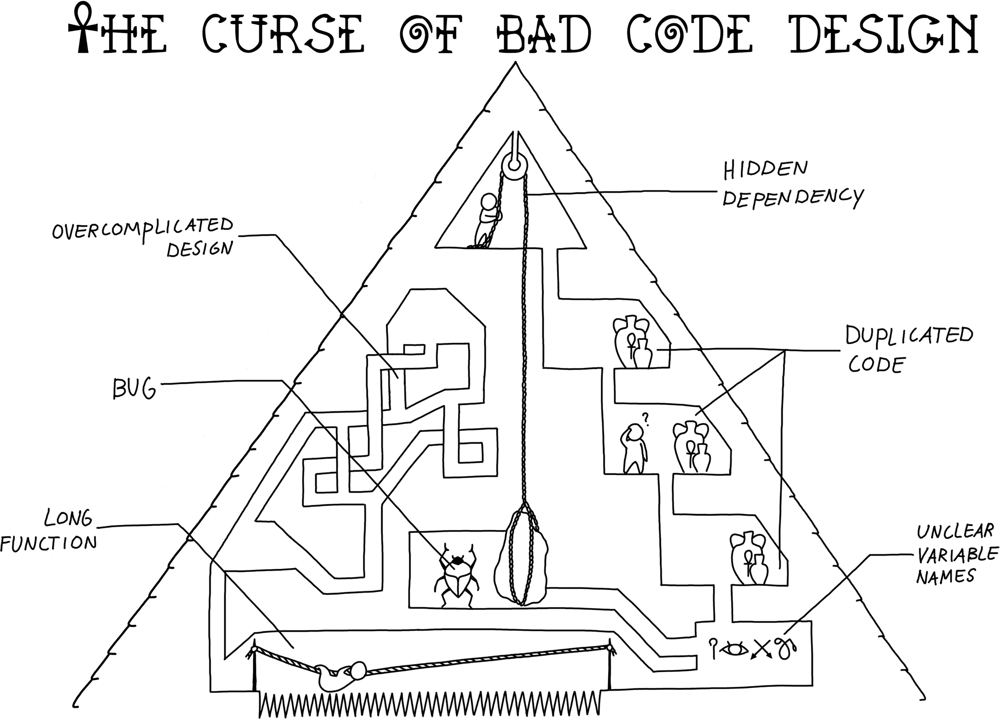

class: center, middle

# Modular Code Development - what to do?

## Bjørn Lindi, NTNU

---

## How it is beeing teached.

Radovan demonstrate how a simple script can be made more general.
The purpose is to make it more general such that the code produced can find more use.

(Ten simple rules for quick and dirty scientific programming. PLoS Comput Biol 17(3): e1008549. https://doi.org/10.1371/journal.pcbi.1008549)
---

## Pros and cons with the current lesson

- Pros:
    - Enages participants through the HackMD with suggestions on how to proceed.

- Cons:
    - Engages only parts of the audience.
    - Have anyone else than RB delivered this lesson?

---

## What other approached have we tried?

- We have a [presentation](https://github.com/coderefinery/modular-code-development/blob/master/talk.md) on modular code development. The presentation is 15-20 minutes long, illustrating different concepts.
- The lesson ends with group work and a plenum discussion on different aspects modular code development.
- This approach have only been used with physical CodeRefinery lesson, with 20-60 attendances.

---

## Pros and cons with the previous approach

- Pros:
    - The group work engaged everyone present
    - It lead to interesting discussions
- Cons:
    - This approach do not scale online
---

## What other ways to deliver "Modular Code Development"?

- We could let the participants do the code development. The challenge is to present the target in a meaningful way.

- Pros:
    - Will be more engaging?
    - 

- Cons:
    - To challenging task
